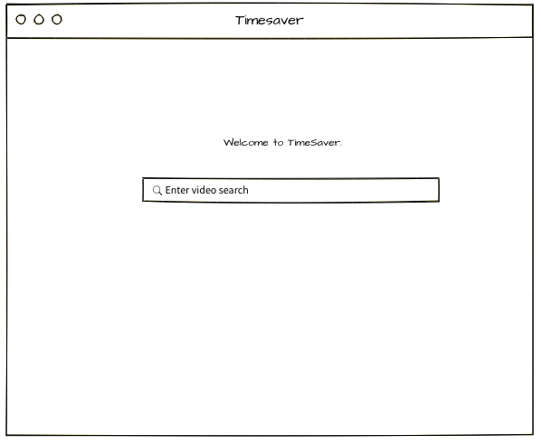
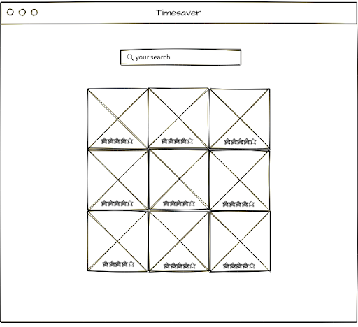

* Project Title: Time Saver

* Problem Statement: We believe that the YouTube interface has become too cluttered and thus are tyring to streamline the process of searching for videos. 

* How we will solve the problem: To solve this problem we are aiming to display several videos (in a grid pattern) related to the user's query. All the videos will be displayed at once. The will allow the user to evaluate many of their options at once instead of only one video at a time.

* Features we will implement:

    Easy to use search bar to enter in a query

    User can pick (within a reasonable range) how many videos they want to be displayed in the grid

    User can rate videos- the good ones move to the top, the bad ones can be replaced

* Data prototype will be using and collecting: Data being collected is what keyword the user wants to search for and if they like the videos the website chooses for them.

* Algorithms and special techniques: Using YouTube API to display top search results, if user down-votes a video replace the video by hitting YouTube API again and getting next result

* Wireframes:

# Comments by Ming
* For some reason, I really like this idea.  Hey you may never know, you may come up with new interface for YT then get bought out.  That happened before you know.
